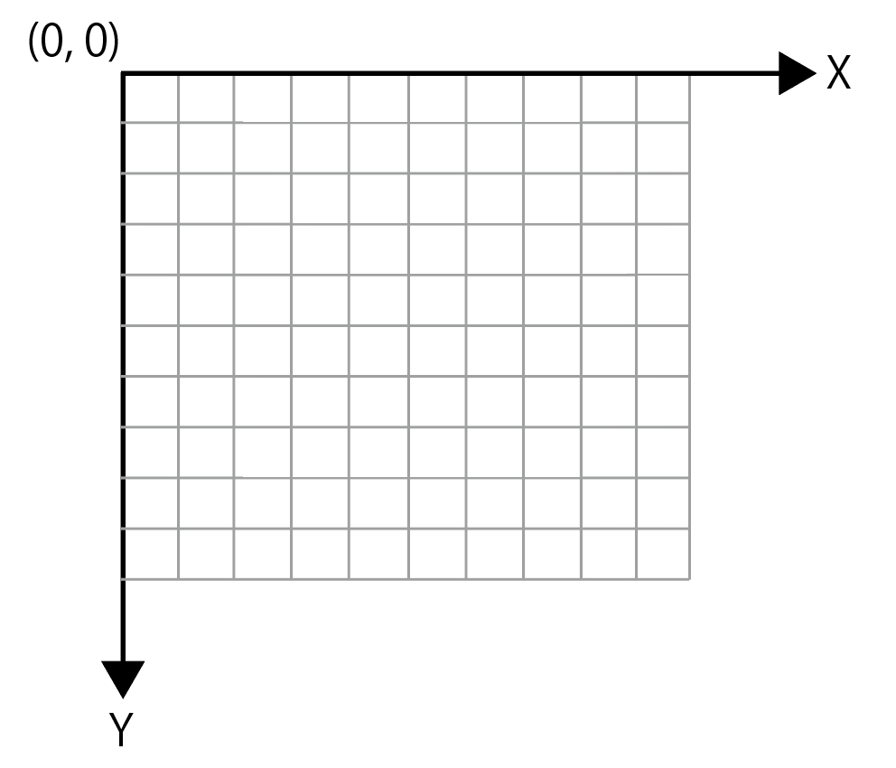

# 初めに知っておきたい事

processingを始める際に知っておきたい事
- 画面の大きさの設定
- 座標系

## 画面の大きさ

```java
size(x, y);
```
- x：x座標(横幅)
- y：y座標(高さ)

## 座標系

知っておきたい点として
- 基本的に2D。xが横、yが縦を表す
- 画面左上が原点(0,0)

ちなみに
- 3Dの描画も可能




## 点を打つ

```java
point(x, y);
```

- x：x座標
- y：y座標

座標(x, y)に点を打つことが出来る。

## セミコロン

各文の最後にセミコロンを打つようにする。日本語の句点と同じようなもの。